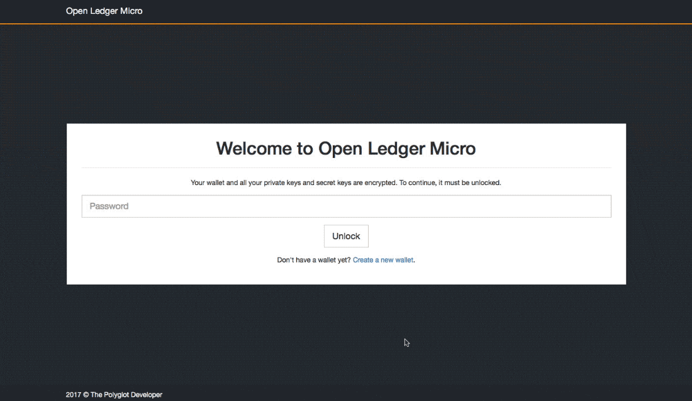

# Open Ledger Micro

An open source hardware wallet application for Raspberry Pi Zero devices, written in Golang and Angular.



## How it Works

The Raspberry Pi Zero is a $5.00 computer with no WiFi or Bluetooth and can be configured to emulate Ethernet over USB. The application written in Go and Angular, serves a RESTful API to be consumed with the integrated Angular application.

Once configured, software like Bonjour on a host machine will allow the Raspberry Pi Zero to be accessed by its hostname. For example, http://raspberrypi.local would show the Angular web application.

Sensitive information such as private keys are encrypted on the Raspberry Pi and are never exposed through HTTP. Transactions are created and signed directly on the device and returned to the Angular application.

## Test with Docker

For testing purposes, a Docker blueprint has been provided with this repository. Assuming you've got Docker installed, execute the following:

```
git clone https://github.com/nraboy/open-ledger-micro
cd open-ledger-micro
docker build -t open-ledger-micro .
docker run -d -p 12345:12345 --name open-ledger-micro open-ledger-micro
```

The above command will build a Docker image from the repository which includes building the Angular project and bundling it in a built Golang binary. When a container is deployed, the compiled binary will be ran.

## Disclaimer

I, Nic Raboy, am not a cryptocurrency or cryptography expert. Take time to understand how Bitcoin and other cryptocurrencies work and use this project at your own risk. If you lose your keys or send your coins into a black hole, nobody is responsible except yourself.

## Contact Me

If you'd like to contact me about the project, find me on Twitter at [@nraboy](https://www.twitter.com/nraboy).

## Donate

If you found this project useful, consider donating so more resources can be invested in it or other quality projects like it:

PayPal - [https://paypal.me/nraboy](https://paypal.me/nraboy)

Bitcoin - [15sf3hLC4JqdBzBxSZ6PWFhbVy85Wo9Whd](bitcoin:15sf3hLC4JqdBzBxSZ6PWFhbVy85Wo9Whd)

## Resources

[Create a Bitcoin Hardware Wallet with Golang and a Raspberry Pi Zero](https://www.thepolyglotdeveloper.com/2018/03/create-bitcoin-hardware-wallet-golang-raspberry-pi-zero)
